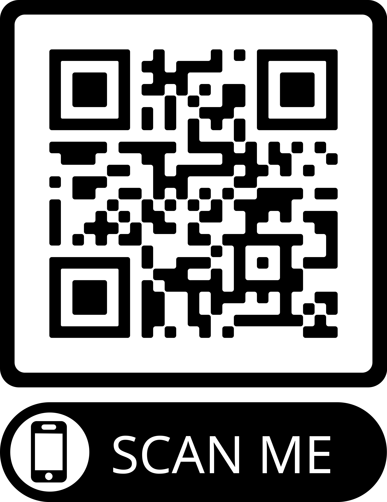

# Tua Obra

O trabalho de aplicação TuaObra, desenvolvido pela turma 5729 do curso de Aprendizagem
 emQualificação de Vendas do SENAC São Leopoldo, visa oferecer uma solução inovadora
 para o reaproveitamento de materiais de construção. O aplicativo, idealizado para facilitar a
 doação de sobras de obras, conecta doadores a pessoas em situação de vulnerabilidade,
 principalmente aquelas afetadas por desastres naturais, como enchentes, ou que enfrentam
 dificuldades financeiras para realizar reformas em suas casas.
 Oprojeto nasceu durante a competição Rally Siga, onde a turma conquistou o terceiro lugar,
 e se transformou em uma iniciativa de impacto social e ambiental.

## Acesse o Projeto

Você pode acessar o projeto através do GitHub Pages ou escanear o QR code abaixo:

## Como usar

1. Acesse a URL do seu projeto:
   - [URL do projeto no GitHub Pages](https://<seu-usuario>.github.io/<nome-do-repositorio>)
   
2. Ou escaneie o QR Code com seu celular para abrir o site diretamente.

## Funcionalidades

-  O app deve ter uma tela de entrada com o logo e o lema e tela de cadastro de usuários;
 Após cadastro de usuário, deve mostrar uma tela de opções(Receber/Doar) de solicitar
 material ou disponibilizar material.
 Ao selecionar solicitar material(Receber), criar uma tela de escolha de materiais e mostrar
 os doadores disponíveis. Os materiais de exemplo são tijolos, cimento, telhas, etc. Deve ter
 uma busca por material e localização.
 Ao selecionar disponibilizar material(Doar), criar uma tela de cadastro de material a doar.
 Emtodas as telas deve ter um carrossel fornecendo informações sobre reciclagem e
 consumo consciente de materiais

## Como Contribuir

Se você deseja contribuir com o projeto, siga os passos abaixo:

1. Faça um fork deste repositório.
2. Crie uma branch para suas alterações (`git checkout -b minha-alteracao`).
3. Commit suas alterações (`git commit -am 'Adicionando nova funcionalidade'`).
4. Envie para o repositório remoto (`git push origin minha-alteracao`).
5. Crie um novo Pull Request.

## Licença

Serviço Nacional de Aprendizagem Comercial- SENAC
 Técnico em Desenvolvimento de Sistemas- TDS
 UC12- Desenvolver Interface Web para Desktop
